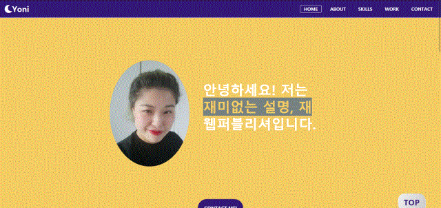
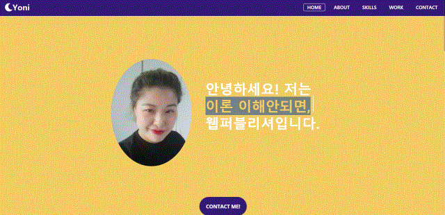

# PORTFOLIO
>개인 포트폴리오 사이트 

|포플주소|사용언어|완성모습|반응형|
|:--:|:--:|:--:|:--:|
|click=> [Yoni 포트폴리오](http://alterego.dothome.co.kr/Portfolio/)|<strong>HTMl,CSS,JS</strong>||**반응형 O** |

---

### 컨셉정리

click ==> [notion 링크](https://heavenly-ant-3f9.notion.site/Portfollo-WebSite-016f1c7f822d404eb0aa01feba9d9c98)
---  

    
2021.8.24 수정사항
 

## <b>css에 재밌는 기능을 찾았다! ╚(•⌂•)╝  
## 'Scroll Snap' 을 사용하여  
### 스크롤시 해당세션에 맞춰내려가게 수정했다.</b>
     

 

### => 살짝만 내려도 해당세션 위로 스르륵 이동된다.</b>

---
---  

    
2021.8.15 수정사항
 

## <b>Intersection Observer API을 사용하여  
###__스크롤시 해당세션과 관련된 메뉴버튼이 변하게 설정</b>
     

 

### 하지만 새로운 문제 발견..  
 - 위로 올렸을때 특정 세션을 건너뛰는 버그가 있음
 - 크기를 줄였을때는 아래 스크롤시 건너뛰는 문제점 발생..
 
 => API 이해도 부족으로 나중에 천천히 수정 예정... 😭😭😢

---